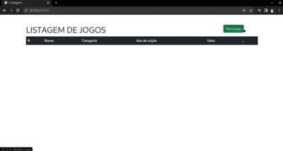

# CADASTRO DE JOGOS

## Projeto desenvolvido com Laravel

<h1 align="center">
    
</h1>

### Rodando o projeto
~~~bash
# Clone este repositório
# Certifique-se de possuir o Ambiente de desenvolvimento Laravel configurado e MySQL instalado.

# Rodando a migrate:
$ php artisan migrate

# Execute a aplicação em modo de desenvolvimento:
$ php artisan serve

~~~
